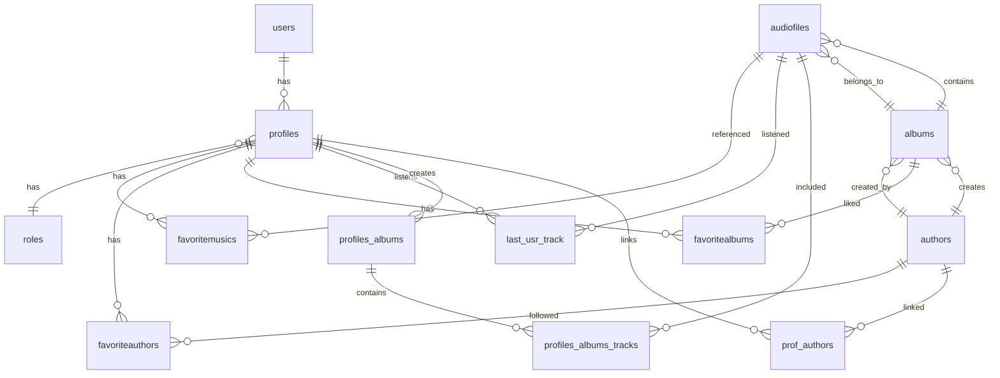

# 🎵 Музыкальная платформа - База данных `wm`

[](https://www.mysql.com/)
[](LICENSE)
[]()

## 📋 Описание проекта

**`wm`** (Web Music) – это реляционная база данных для сайта по прослушиванию музыки, разработанная в рамках курсового проекта по дисциплине **МДК.11.01 - Технология разработки и защиты баз данных**.

База данных обеспечивает полный цикл работы музыкального сервиса: управление пользователями, каталогизацию треков, альбомов и авторов, систему избранного, историю прослушиваний, пользовательские плейлисты и ролевую модель.

## ✨ Основные возможности
```
| Функция | Описание |
|---------|----------|
| 👤 **Управление пользователями** | Регистрация, авторизация, профили, аватары |
| 🎭 **Ролевая модель** | Три роли: пользователь, автор, администратор |
| 🎵 **Каталог музыки** | Треки, альбомы, авторы, жанры |
| ❤️ **Система избранного** | Избранные треки, альбомы, авторы |
| 📜 **История прослушиваний** | Отслеживание последних прослушанных треков |
| 📁 **Плейлисты** | Создание и редактирование пользовательских плейлистов |
| 📊 **Аналитика** | Статистика по пользователям, авторам, трекам |
| 🔍 **Поиск и рекомендации** | Поиск по трекам и рекомендации на основе предпочтений |
```
## 🏗️ Структура базы данных

### ER-диаграмма



    Список таблиц (13 таблиц)
№	Таблица	Назначение
1	users	Учетные записи пользователей
2	profiles	Профили пользователей
3	roles	Роли (user, author, admin)
4	authors	Авторы музыки
5	albums	Музыкальные альбомы
6	audiofiles	Аудиотреки
7	favoritemusics	Избранные треки
8	favoriteauthors	Избранные авторы
9	favoritealbums	Избранные альбомы
10	last_usr_track	История прослушиваний
11	profiles_albums	Плейлисты пользователей
12	profiles_albums_tracks	Треки в плейлистах
13	prof_authors	Связь профилей с авторами
Нормальная форма

База данных находится в третьей нормальной форме (3НФ):

    ✅ 1НФ: атомарные значения, нет повторяющихся групп

    ✅ 2НФ: нет частичных зависимостей (отсутствуют составные ключи)

    ✅ 3НФ: нет транзитивных зависимостей

🛠️ Функциональные объекты
Триггеры
Триггер	Событие	Назначение

create_author	AFTER INSERT ON profiles	Автоматически создает автора при role_id=2 
switch_to_author	AFTER UPDATE ON profiles	Создает автора при изменении роли на author
Хранимые процедуры
Процедура	Параметры	Назначение
create_user	name, email, password, role	Создание пользователя с проверкой уникальности
add_new_track	title, code_name, file, album_id, ...	Добавление трека (с транзакцией)
add_to_favorites	audiofile_id, profile_id	Добавление трека в избранное
remove_from_favorites	audiofile_id, profile_id	Удаление трека из избранного
Пользовательская функция
Функция	Параметры	Возвращает	Назначение
get_author_total_listens	author_id INT	BIGINT	Суммарные прослушивания автора
Представления (VIEW)
Представление	Назначение
tracks_details	Детальная информация о треках (JOIN audiofiles, albums, authors)
authors_statistics	Статистика по авторам с рейтингом (DENSE_RANK)
users_full_statistics	Полная статистика по пользователям
user_categories_with_details	Анализ предпочтений по категориям
users_albums	Плейлисты пользователей с треками

🚀 Быстрый старт
Требования

    MySQL 8.0 или выше

    100 MB свободного места

Установка
```bash

# 1. Клонировать репозиторий
git clone https://github.com/username/music-platform-db.git
cd music-platform-db

# 2. Подключиться к MySQL
mysql -u root -p

# 3. Выполнить главный скрипт развертывания
source sql/08_deploy_all.sql;

Пошаговое развертывание (вручную)
sql

-- 1. Создание таблиц
source sql/01_schema.sql;

-- 2. Создание триггеров
source sql/02_triggers.sql;

-- 3. Создание функций
source sql/03_functions.sql;

-- 4. Создание процедур
source sql/04_procedures.sql;

-- 5. Создание представлений
source sql/05_views.sql;

-- 6. Заполнение тестовыми данными
source sql/07_data.sql;

-- 7. Выполнение типовых запросов
source sql/06_queries.sql;
```
📊 Типовые запросы
```
1. Топ-10 популярных треков
sql

SELECT td.title, td.authors_name, td.listens
FROM tracks_details td
ORDER BY td.listens DESC LIMIT 10;

2. Статистика пользователя
sql

SELECT u.name, COUNT(DISTINCT fm.audiofiles_id) AS favorite_tracks
FROM users u
LEFT JOIN profiles p ON u.id = p.users_id
LEFT JOIN favoritemusics fm ON p.id = fm.profiles_id
WHERE u.id = 1 GROUP BY u.id;

3. Рекомендации по жанрам (CTE)
sql

WITH user_genres AS (
    SELECT DISTINCT td.category
    FROM favoritemusics fm
    JOIN tracks_details td ON fm.audiofiles_id = td.audio_id
    WHERE fm.profiles_id = 1
)
SELECT td.title, td.authors_name
FROM tracks_details td
WHERE td.category IN (SELECT category FROM user_genres)
LIMIT 10;

4. Рейтинг авторов
sql

SELECT a.name, COUNT(DISTINCT alb.id) AS albums,
       COALESCE(SUM(af.listens), 0) AS total_listens,
       DENSE_RANK() OVER (ORDER BY COALESCE(SUM(af.listens), 0) DESC) AS rank
FROM authors a
LEFT JOIN albums alb ON a.id = alb.authors_id
LEFT JOIN audiofiles af ON alb.id = af.albums_id
GROUP BY a.id ORDER BY rank;

5. История прослушиваний
sql

SELECT td.title, td.authors_name, lpt.id AS listen_time
FROM last_usr_track lpt
JOIN tracks_details td ON lpt.audiofiles_id = td.audio_id
WHERE lpt.profiles_id = 1 ORDER BY lpt.id DESC;
```
🧪 Тестовые данные
```
После развертывания база данных будет содержать:
Таблица	Количество записей
roles	3
users	5
profiles	5
authors	2
albums	4
audiofiles	12
favoritemusics	10
favoriteauthors	5
favoritealbums	6
last_usr_track	10
profiles_albums	3
profiles_albums_tracks	11
Тестовые пользователи
Имя пользователя	Email	Роль	Пароль
ivan_petrov	ivan@example.com	user	password123
maria_sidorova	maria@example.com	author	password123
alexey_smirnov	alexey@example.com	author	password123
elena_kozlova	elena@example.com	user	password123
dmitry_volkov	dmitry@example.com	admin	password123
```

