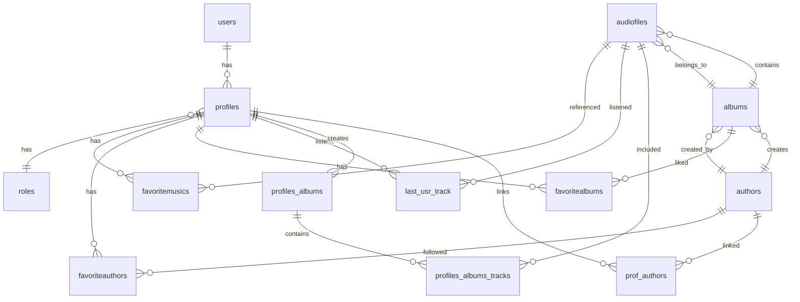

# 🎵 Музыкальная платформа - База данных `wm`

[](https://www.mysql.com/)
[](LICENSE)
[]()

## 📋 Описание проекта

**`wm`** (Web Music) – это реляционная база данных для сайта по прослушиванию музыки, разработанная в рамках курсового проекта по дисциплине **МДК.11.01 - Технология разработки и защиты баз данных**.

База данных обеспечивает полный цикл работы музыкального сервиса: управление пользователями, каталогизацию треков, альбомов и авторов, систему избранного, историю прослушиваний, пользовательские плейлисты и ролевую модель.

## ✨ Основные возможности
```
| Функция | Описание |
|---------|----------|
| 👤 **Управление пользователями** | Регистрация, авторизация, профили, аватары |
| 🎭 **Ролевая модель** | Три роли: пользователь, автор, администратор |
| 🎵 **Каталог музыки** | Треки, альбомы, авторы, жанры |
| ❤️ **Система избранного** | Избранные треки, альбомы, авторы |
| 📜 **История прослушиваний** | Отслеживание последних прослушанных треков |
| 📁 **Плейлисты** | Создание и редактирование пользовательских плейлистов |
| 📊 **Аналитика** | Статистика по пользователям, авторам, трекам |
| 🔍 **Поиск и рекомендации** | Поиск по трекам и рекомендации на основе предпочтений |
```
## 🏗️ Структура базы данных

### ER-диаграмма



    Список таблиц (13 таблиц)
№	Таблица	Назначение
1	users	Учетные записи пользователей
2	profiles	Профили пользователей
3	roles	Роли (user, author, admin)
4	authors	Авторы музыки
5	albums	Музыкальные альбомы
6	audiofiles	Аудиотреки
7	favoritemusics	Избранные треки
8	favoriteauthors	Избранные авторы
9	favoritealbums	Избранные альбомы
10	last_usr_track	История прослушиваний
11	profiles_albums	Плейлисты пользователей
12	profiles_albums_tracks	Треки в плейлистах
13	prof_authors	Связь профилей с авторами
Нормальная форма

База данных находится в третьей нормальной форме (3НФ):

    ✅ 1НФ: атомарные значения, нет повторяющихся групп

    ✅ 2НФ: нет частичных зависимостей (отсутствуют составные ключи)

    ✅ 3НФ: нет транзитивных зависимостей

🛠️ Функциональные объекты
Триггеры
Триггер	Событие	Назначение

create_author	AFTER INSERT ON profiles	Автоматически создает автора при role_id=2 
switch_to_author	AFTER UPDATE ON profiles	Создает автора при изменении роли на author
Хранимые процедуры
Процедура	Параметры	Назначение
create_user	name, email, password, role	Создание пользователя с проверкой уникальности
add_new_track	title, code_name, file, album_id, ...	Добавление трека (с транзакцией)
add_to_favorites	audiofile_id, profile_id	Добавление трека в избранное
remove_from_favorites	audiofile_id, profile_id	Удаление трека из избранного
Пользовательская функция
Функция	Параметры	Возвращает	Назначение
get_author_total_listens	author_id INT	BIGINT	Суммарные прослушивания автора
Представления (VIEW)
Представление	Назначение
tracks_details	Детальная информация о треках (JOIN audiofiles, albums, authors)
authors_statistics	Статистика по авторам с рейтингом (DENSE_RANK)
users_full_statistics	Полная статистика по пользователям
user_categories_with_details	Анализ предпочтений по категориям
users_albums	Плейлисты пользователей с треками


